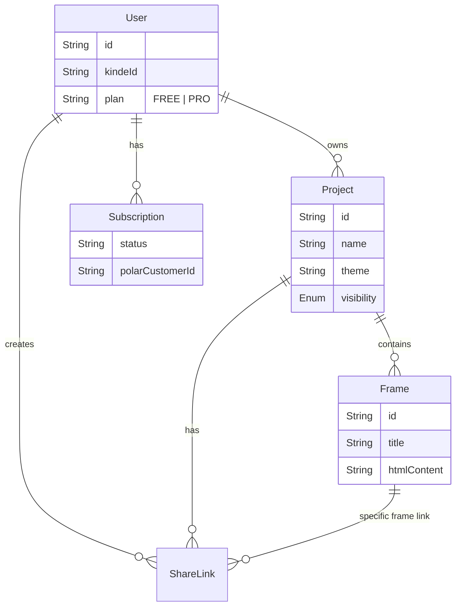

# XDesign Mobile Agent SaaS

## 🚀 Overview
**XDesign-Mobile-Agent-SaaS** is an advanced AI-powered platform designed to rapidly prototype mobile application user interfaces. It allows users to describe their app idea in natural language, and the system autonomously generates a complete, multi-screen mobile UI mockups using Tailwind CSS. The platform features an infinite canvas for interaction, real-time code generation, and developer-focused tools for export and customization.

## 🏗️ Architecture

The application is built on a modern serverless stack, leveraging **Next.js** for the frontend and API, **Inngest** for durable background workflows (crucial for long-running AI tasks), and **MongoDB** (via Prisma) for data persistence.

```mermaid
graph TD
    User[User Client] -->|HTTP Request| Next[Next.js App Router]
    Next -->|Auth| Kinde[Kinde Auth]
    Next -->|Data| Prisma[Prisma ORM]
    Prisma -->|Persist| Mongo[MongoDB]
    
    Next -->|Trigger Job| Inngest[Inngest Serverless Queue]
    Inngest -->|Execute| Func[Generate Screens Function]
    
    Func -->|Plan UI| LLM1[LLM (Analyzer)]
    Func -->|Generate Code| LLM2[LLM (Coder)]
    
    LLM1 & LLM2 -->|API| OpenRouter[OpenRouter / Gemini]
    LLM2 -->|Search Images| Unsplash[Unsplash API]
    
    Func -->|Stream Updates| Socket[Real-time Events]
    Socket -->|Update UI| User
```

## 🛠️ Technology Stack

| Component | Technology | Purpose |
| :--- | :--- | :--- |
| **Framework** | Next.js 14+ | Core application framework (App Router) |
| **Language** | TypeScript | Type safety and code quality |
| **Database** | MongoDB | NoSQL document storage for flexible schema |
| **ORM** | Prisma | Database schema and type-safe queries |
| **Styling** | Tailwind CSS | Utility-first CSS for generated UIs |
| **Queue/Jobs** | Inngest | Orchestrating multi-step AI workflows |
| **AI / LLM** | OpenRouter / Gemini | Core intelligence for UI planning and coding |
| **Auth** | Kinde | Secure user authentication |
| **Billing** | Polar.sh | Subscription and payment management |
| **UI Library** | Radix UI / Shadcn | Accessible component primitives |
| **Canvas** | React-Zoom-Pan-Pinch | Figma-like infinite canvas interaction |

## 🧩 Core Features & Modules

### 1. Intelligent AI Generation Pipeline
The core value proposition is the multi-step AI generation process. It creates high-fidelity, context-aware screens.

| Feature | Description |
| :--- | :--- |
| **Intent Analysis** | First, an "Architect" LLM analyzes the user prompt to plan the app structure, navigation flow, and screen purposes. |
| **Contextual Generation** | Screens are generated sequentially. Screen N+1 is aware of Screen N's design to ensure visual consistency. |
| **Self-Correction** | The system validates generated HTML. If it detects malformed code, it automatically triggers a regeneration attempt. |
| **Visual Assets** | Automatically fetches relevant high-quality images from Unsplash to populate the designs. |

### 2. The Canvas (Workspace)
A highly interactive environment for viewing and managing generated designs.
- **Infinite Zoom/Pan**: Navigate large projects easily.
- **Device Frames**: Renders HTML in isolated iframes to prevent style conflicts.
- **Skeleton Loading**: Visual feedback during the generation process.

### 3. Developer Tools
- **Code Export**: View and copy the raw HTML/Tailwind code.
- **Image Export** *(Pro)*: Download high-resolution PNG screenshots of the designs.
- **Regeneration**: Select specific screens to regenerate with new instructions.

## 💾 Database Schema

The data model centers around `Users` who own `Projects`, which contain multiple `Frames` (screens).



## 🤖 AI Workflow Logic

The `generateScreens` function in `inngest/functions` is the brain of the operation.

```mermaid
flowchart TD
    Start[User Prompt] --> Step1{Analyze & Plan}
    Step1 -->|JSON Plan| Plan[Screen List: [Home, Profile, Settings...]]
    
    Plan --> Loop[Loop through Screens]
    
    Loop --> Context[Build Context]
    Context -->|Add Previous Screens| Prompt
    Context -->|Add Theme Variables| Prompt
    
    Prompt --> Gen[Generate HTML]
    Gen --> Validate{Valid HTML?}
    
    Validate -->|No| Retry[Retry Generation]
    Validate -->|Yes| Save[Save to DB]
    
    Save --> Next{More Screens?}
    Next -->|Yes| Loop
    Next -->|No| Finish[Complete]
```

## 💰 Monetization & Plans

The app uses a freemium model managed by Polar.sh.

| Feature | Free Plan | Pro Plan |
| :--- | :---: | :---: |
| **Screen Limit** | Max 2 screens per generation | Max 5 screens per generation |
| **Themes** | Basic themes only | Access to all themes (e.g., Neo-Brutalism) |
| **Styles** | Standard | "Pro" polished styling instructions |
| **Export** | Code only | Code + PNG Image Export |
| **History** | Standard | Full project history |

## 📂 Project Structure

```text
/app
  /api          # Next.js API Routes (Auth, Billing, Project management)
  /(routes)     # Frontend pages (Dashboard, Canvas, Landing)
  /action       # Server Actions for form submissions
/components
  /canvas       # The main workspace logic (Zoomable canvas, Device frames)
  /ui           # Reusable UI components (Buttons, Dialogs)
/inngest
  /functions    # Background job definitions (The AI Logic)
/lib
  ai-models.ts  # Model configurations (Gemini, OpenRouter)
  prompt.ts     # System prompts for the LLM
  themes.ts     # CSS variable definitions for different visual themes
/prisma         # Database schema
```

## 🧪 Key APIs

| Method | Endpoint | Description |
| :--- | :--- | :--- |
| `POST` | `/api/project` | Creates a new project and triggers generation. |
| `POST` | `/api/project/[id]/frame/regenerate` | Regenerates a specific frame with new constraints. |
| `POST` | `/api/screenshot` | Generates a screenshot of the canvas (Pro feature). |
| `GET` | `/api/auth/[kindeAuth]` | Handles Kinde authentication flows. |
| `POST` | `/api/webhooks/polar` | Listens for subscription updates from Polar. |

---
*Research generated by Gemini CLI Agent.*
