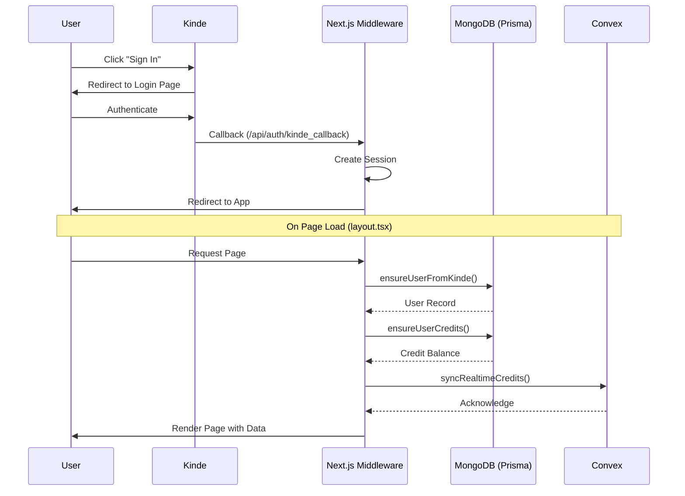
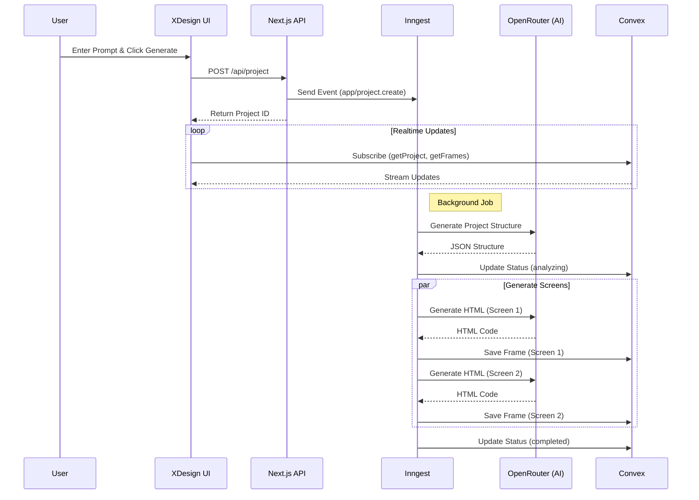
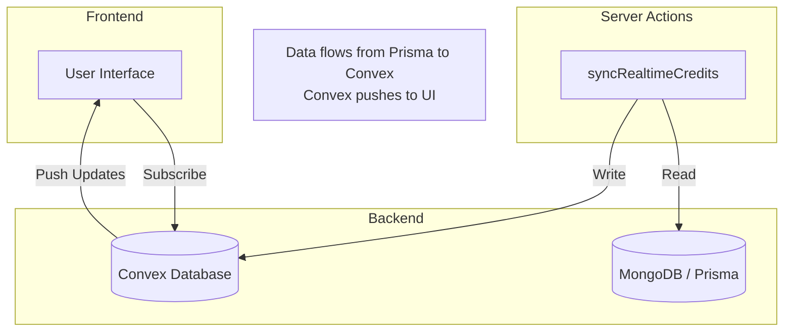

# XTool.ai - AI Workspace

XTool.ai is a comprehensive AI-powered workspace designed to streamline application development and content creation. It integrates multiple AI tools into a single platform, leveraging event-driven architecture and realtime data syncing for a seamless user experience.

## Tech Stack

| Category | Technology | Description |
| :--- | :--- | :--- |
| **Framework** | Next.js 15 | App Router, Server Actions, React Server Components |
| **Language** | TypeScript | Static typing for reliability |
| **Styling** | Tailwind CSS | Utility-first CSS framework |
| **UI Library** | Shadcn UI | Reusable components built on Radix UI |
| **Auth** | Kinde Auth | Secure, passwordless authentication |
| **Database** | Prisma (MongoDB) | ORM for user and transaction data |
| **Realtime** | Convex | Realtime backend for project state and credits |
| **Queue** | Inngest | Event-driven background job processing |
| **AI Models** | OpenRouter | Access to various LLMs (Claude, GPT-4, etc.) |

## Modules

| Module | Route | Description |
| :--- | :--- | :--- |
| **XDesign** | `/xdesign` | AI-powered mobile app UI generator. Generates multi-screen mockups from text prompts. |
| **XCreator** | `/xcreator` | Content creation suite (details pending implementation). |
| **Xcode CLI** | `/xcode-cli` | Integration with local development workflows via CLI. |
| **Billing** | `/billing` | Credit management, transaction history, and top-ups. |
| **Account** | `/account` | User profile and settings management. |

## System Architecture

### 1. Authentication Flow (Kinde)

The application uses Kinde for secure authentication.



1.  **Login/Register**: User clicks "Sign In" and is redirected to Kinde's hosted page.
2.  **Callback**: Upon success, Kinde redirects back to `/api/auth/kinde_callback`.
3.  **Session Creation**: Next.js middleware establishes a session.
4.  **Data Sync (`app/layout.tsx`)**:
    *   On every page load, the root layout checks the Kinde session.
    *   `ensureUserFromKinde`: Syncs user profile to Prisma `User` table.
    *   `ensureUserCredits`: Initializes or retrieves user credits.
    *   `syncRealtimeCredits`: Pushes latest credit balance and transactions to Convex for realtime access.

### 2. Event-Driven Generation (Inngest)

Heavy AI tasks are handled asynchronously using Inngest to prevent timeouts and ensure reliability.



**Flow: Generating a Project**
1.  **Trigger**: User submits a prompt in `XDesign`.
2.  **API Call**: `POST /api/project` is called.
3.  **Event Sent**: The API sends an `app/project.create` event to Inngest.
4.  **Function Execution** (`inngest/functions/generateScreens.ts`):
    *   Inngest picks up the event.
    *   **Step 1**: Calls LLM to generate project structure and screen descriptions.
    *   **Step 2**: Updates Convex `realtimeProjects` status to `analyzing`.
    *   **Step 3**: Generates HTML code for each screen in parallel.
    *   **Step 4**: Updates Convex `realtimeFrames` with the generated code.
    *   **Step 5**: Marks project as `completed`.

### 3. Realtime Data Sync (Convex)

Convex is used as a realtime layer to keep the frontend updated instantly without polling.



*   **Projects & Frames**: The `XDesign` UI subscribes to `api.realtime.getProject` and `api.realtime.getFrames`. As Inngest generates content, the UI updates live.
*   **Credits**: The credit balance in the header subscribes to `api.realtime.getUserCredits`. When a generation consumes credits, the backend updates Convex, and the user sees the deduction immediately.

## Directory Structure

```
├── app/
│   ├── (routes)/       # Application routes and pages
│   ├── api/            # API routes (Auth, Inngest, Project)
│   └── layout.tsx      # Root layout with global providers
├── components/         # Reusable UI components
├── convex/             # Convex backend logic
│   ├── schema.ts       # Realtime database schema
│   └── realtime.ts     # Queries and mutations
├── inngest/            # Background job definitions
│   └── functions/      # Workflow logic (generation, etc.)
├── lib/                # Utility functions
│   ├── credits.ts      # Credit calculation and sync logic
│   └── prisma.ts       # Database client
└── prisma/             # Database schema (MongoDB)
```

## Setup Instructions

1.  **Install Dependencies**:
    ```bash
    npm install
    ```

2.  **Environment Variables**:
    Create a `.env.local` file with keys for Kinde, Convex, Inngest, OpenRouter, and MongoDB.

3.  **Run Development Server**:
    ```bash
    npm run dev
    ```

4.  **Start Inngest Dev Server** (for background jobs):
    ```bash
    npx inngest-cli@latest dev
    ```

5.  **Start Convex**:
    ```bash
    npx convex dev
    ```
