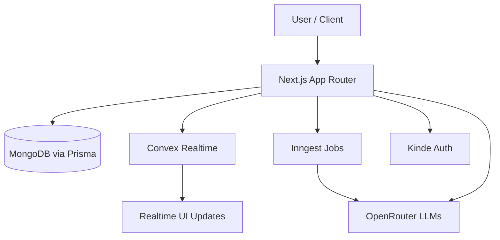
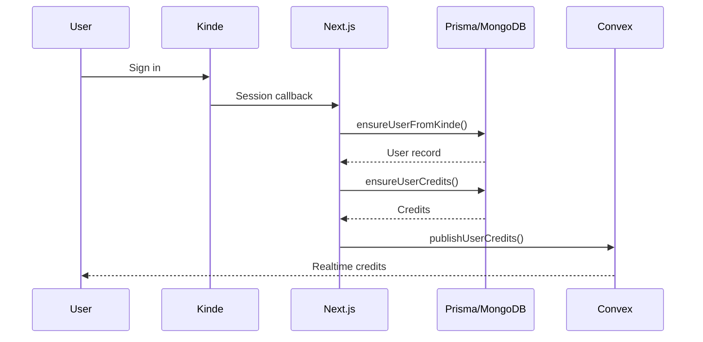
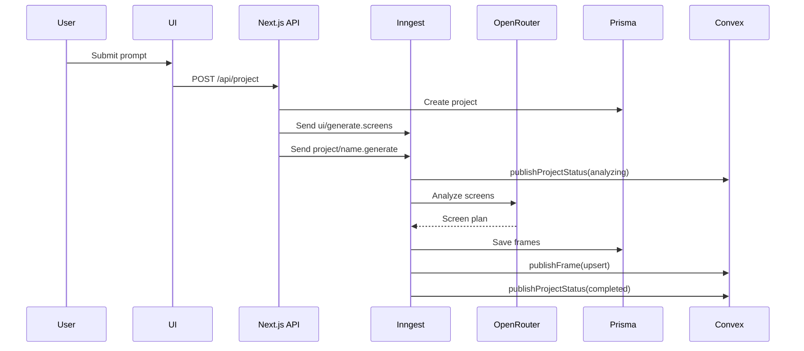
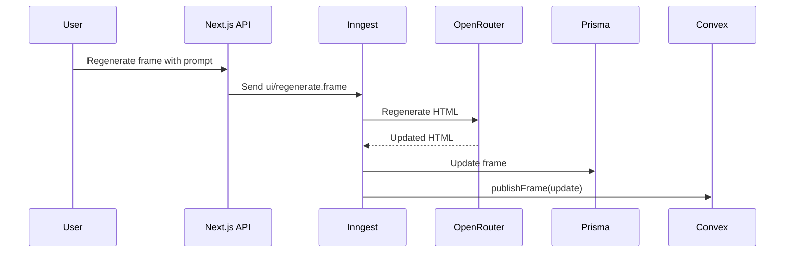
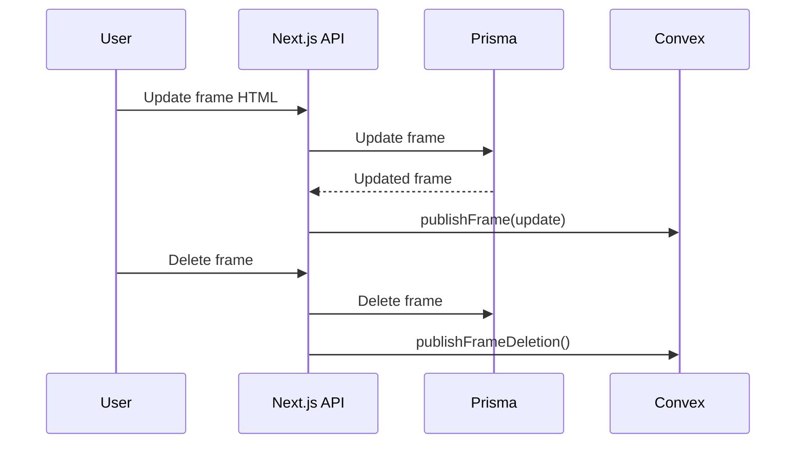
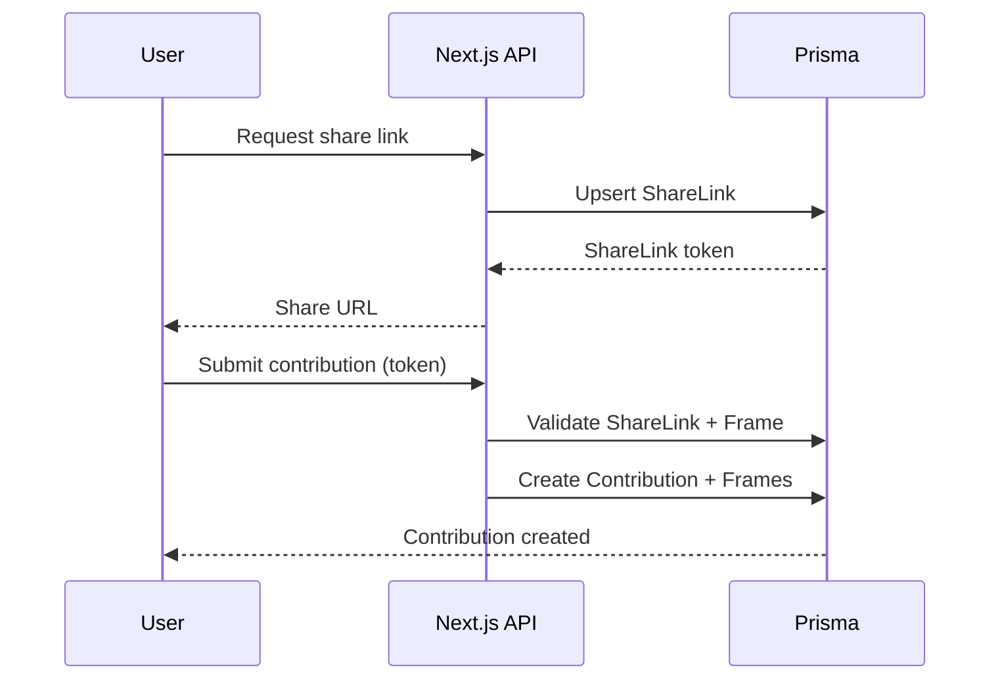
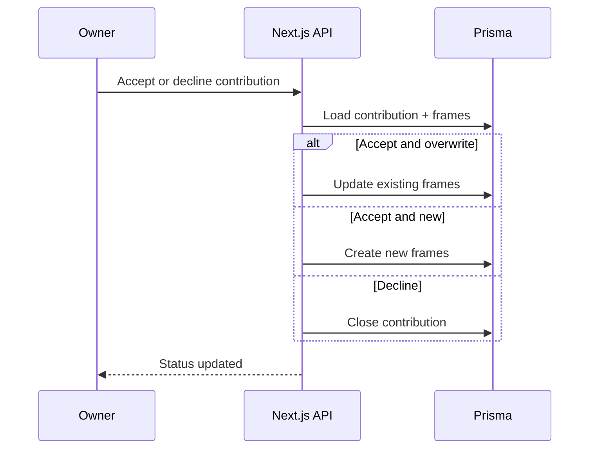
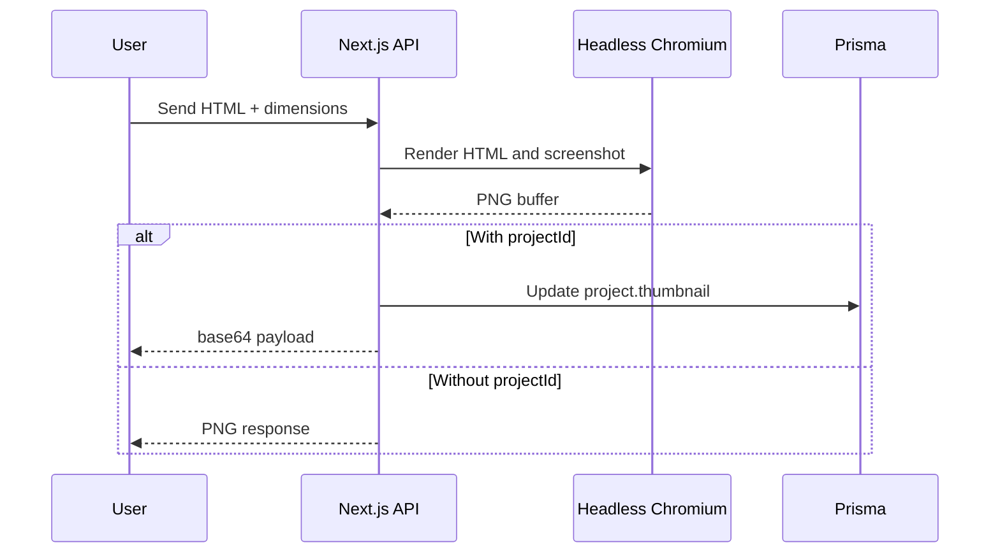
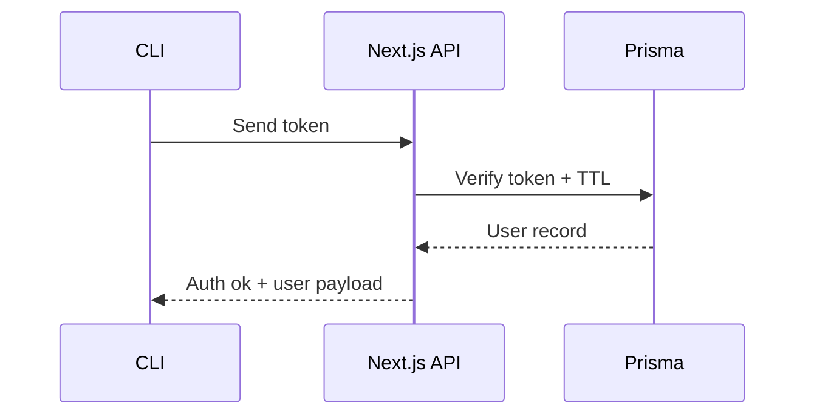
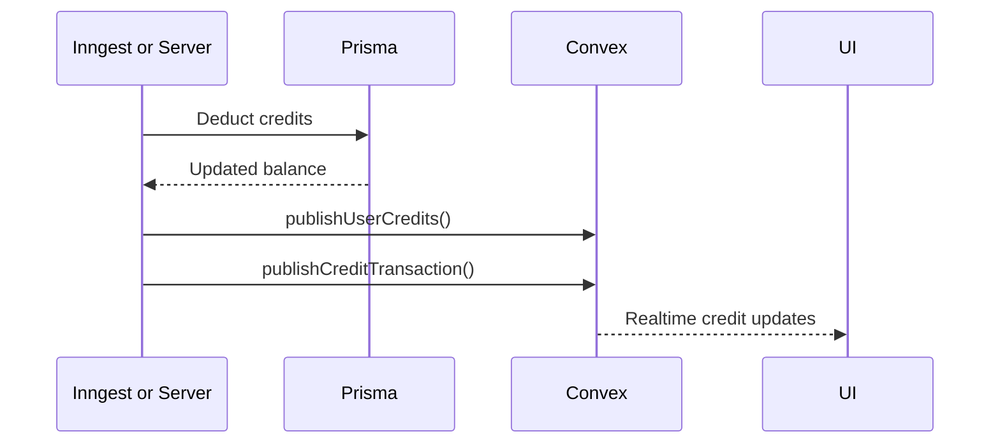

# XTool.ai - AI Workspace

XTool.ai is a unified, AI-enabled workspace that consolidates product design, content workflows, and developer tooling into a single, event-driven platform. The system combines Next.js App Router delivery with asynchronous AI execution (Inngest), realtime state propagation (Convex), and durable persistence (Prisma over MongoDB).

## Platform Scope

| Surface | Route | Intent |
| --- | --- | --- |
| XDesign | `/xdesign` | Multi-screen UI generation and iterative refinement. |
| XCreator | `/xcreator` | Creator-focused workflows (image and video tooling, scheduling). |
| Xcode CLI | `/xcode-cli` | Terminal-first agentic workflow companion. |
| Projects | `/project` | Project library, detail views, and frame management. |
| Explore | `/explore` | Discovery and public-facing browsing. |
| Docs | `/docs` | Documentation and AI-assisted Q and A. |
| Billing | `/billing` | Credit visibility and plan context. |
| Account | `/account` | Profile and settings. |

## Technology Stack

| Layer | Technology | Usage |
| --- | --- | --- |
| Runtime | Next.js 16 | App Router, API routes, server-side orchestration. |
| Language | TypeScript | Domain and API contracts. |
| Styling | Tailwind CSS, Shadcn UI | Component and utility composition. |
| Auth | Kinde | Session management and user identity. |
| Persistence | Prisma (MongoDB) | Core entities, credits, tokens. |
| Realtime | Convex | Project status, frames, credits broadcast. |
| Orchestration | Inngest | Long-running AI workflows and retries. |
| AI | OpenRouter (AI SDK) | Multi-model LLM access with fallbacks. |

## Core Capabilities

| Capability | Description | Primary Implementation |
| --- | --- | --- |
| Project generation | Create projects, name them, and generate screens asynchronously. | `app/api/project`, `inngest/functions/generateScreens.ts` |
| Frame lifecycle | Update, regenerate, delete, and stream frames in realtime. | `app/api/project/[id]/frame/*` |
| Credits | Credit initialization, charging, and realtime ledger updates. | `lib/credits.ts`, `app/api/credits` |
| Sharing | Share links with read-only or edit permissions. | `app/api/share` |
| Contributions | External edits routed as contributions with merge or decline flows. | `app/api/contribution*` |
| Screenshot capture | Render HTML to PNG and persist thumbnail. | `app/api/screenshot` |
| Developer access | Developer allowlist and admin controls. | `app/api/developers*` |
| CLI auth | Token verification for the Xcode CLI. | `app/api/cli/auth/verify`, `lib/cli-auth.ts` |

## Architecture Overview



## Data Model Summary

| Model | Purpose | Relations |
| --- | --- | --- |
| User | Identity, credits, CLI tokens. | `Project`, `ShareLink`, `Contribution`, `CliToken`, `CreditTransaction` |
| Project | Container for generated frames and metadata. | `Frame`, `ShareLink`, `Contribution` |
| Frame | Individual screen HTML content. | `Project`, `ShareLink`, `ContributionFrame` |
| ShareLink | External access to project or frame. | `Project`, `Frame`, `User` |
| Contribution | External edit proposal. | `Project`, `ContributionFrame`, `User` |
| ContributionFrame | Stored edits per contribution. | `Contribution`, `Frame` |
| CreditTransaction | Audit trail for credit usage. | `User` |
| CliToken | CLI authentication with TTL. | `User` |
| Developer | Developer allowlist. | none |

## Flow Index

| Flow | Trigger | Primary API or Event |
| --- | --- | --- |
| Authentication and provisioning | User signs in or loads a sessioned page. | Kinde session + `ensureUserFromKinde` |
| Project creation and generation | User submits a prompt. | `POST /api/project` + `ui/generate.screens` |
| Frame regeneration | User refines a frame. | `POST /api/project/[id]/frame/regenerate` |
| Frame update and delete | User edits or removes a frame. | `PATCH /api/project/[id]/frame/update`, `DELETE /api/project/[id]/frame/delete` |
| Share links and contributions | User shares or edits via token. | `POST /api/share`, `POST /api/contribution` |
| Contribution acceptance | Owner accepts or declines. | `PATCH /api/contribution/[id]` |
| Screenshot capture | User requests preview image. | `POST /api/screenshot` |
| Credits sync and charging | AI usage or initialization. | `lib/credits.ts` + Convex publish |
| CLI token verification | CLI validates a token. | `POST /api/cli/auth/verify` |

## Flowcharts and Operational Tables

### Authentication and Provisioning

| Aspect | Detail |
| --- | --- |
| Entry point | Kinde session retrieval on page load |
| State changes | User upsert, credits initialized, realtime credits broadcast |
| Primary components | `lib/billing.ts`, `lib/credits.ts`, `lib/convex-client.ts` |



### Project Creation and Screen Generation

| Aspect | Detail |
| --- | --- |
| Entry point | `POST /api/project` |
| Background job | `ui/generate.screens` |
| Realtime updates | Project status + frame upserts |



### Frame Regeneration

| Aspect | Detail |
| --- | --- |
| Entry point | `POST /api/project/[id]/frame/regenerate` |
| Charging | Credit deduction per regeneration |
| Realtime updates | Frame update publish |



### Frame Update and Deletion

| Aspect | Detail |
| --- | --- |
| Entry point | `PATCH /api/project/[id]/frame/update`, `DELETE /api/project/[id]/frame/delete` |
| Realtime updates | Frame upsert or deletion broadcast |
| Persistence | Prisma frame update or delete |



### Share Links and Contributions

| Aspect | Detail |
| --- | --- |
| Entry point | `POST /api/share`, `POST /api/contribution` |
| Permissioning | READ_ONLY or EDIT |
| Outputs | Share URL, contribution record |



### Contribution Review (Accept or Decline)

| Aspect | Detail |
| --- | --- |
| Entry point | `PATCH /api/contribution/[id]` |
| Actions | `accept` or `decline` |
| Modes | `overwrite` or `new` |



### Screenshot Capture

| Aspect | Detail |
| --- | --- |
| Entry point | `POST /api/screenshot` |
| Runtime | Puppeteer or Chromium on Vercel |
| Output | PNG response or base64 thumbnail |



### CLI Token Verification

| Aspect | Detail |
| --- | --- |
| Entry point | `POST /api/cli/auth/verify` |
| Security | Bearer token or JSON body token |
| Output | User profile subset |



### Credits Charging and Realtime Sync

| Aspect | Detail |
| --- | --- |
| Entry point | Generation, regeneration, contribution generation |
| Charging | Token-based, minimum prompt charge |
| Realtime | Convex publishes credit and transaction updates |



## API Surface

| Endpoint | Method | Purpose |
| --- | --- | --- |
| `/api/project` | GET, POST | List projects, create project and trigger generation. |
| `/api/project/[id]` | GET, POST, PATCH, DELETE | Fetch, regenerate, update metadata, soft delete. |
| `/api/project/[id]/frame/update` | PATCH | Persist frame HTML and broadcast. |
| `/api/project/[id]/frame/regenerate` | POST | Regenerate a single frame. |
| `/api/project/[id]/frame/delete` | DELETE | Remove a frame and broadcast deletion. |
| `/api/share` | POST | Create share links for projects or frames. |
| `/api/contribution` | GET, POST | List open contributions, submit contribution. |
| `/api/contribution/[id]` | PATCH | Accept or decline contributions. |
| `/api/credits` | GET | Return credit balance. |
| `/api/screenshot` | POST | Render HTML to image. |
| `/api/developers` | GET, POST | Developer allowlist admin. |
| `/api/developers/[id]` | DELETE | Remove developer. |
| `/api/cli/auth/verify` | POST | Verify CLI token. |
| `/api/model` | GET | Report OpenRouter model in use. |
| `/api/openrouter/*` | POST | Create, exchange, and test OpenRouter keys. |
| `/api/docs/chat` | POST | Documentation agent chat via OpenRouter. |
| `/api/inngest` | GET, POST, PUT | Inngest serve endpoint. |

## Billing and Webhook Status

| Endpoint | Status | Behavior |
| --- | --- | --- |
| `/api/checkout` | Disabled | Redirects to `/billing` or returns 410. |
| `/api/billing/portal` | Disabled | Redirects to `/billing`. |
| `/api/webhooks/polar` | Disabled | Returns 410. |

## Environment Configuration

| Variable | Purpose |
| --- | --- |
| `DATABASE_URL` | Prisma MongoDB connection string. |
| `OPENROUTER_API_KEY` | OpenRouter API access for AI calls. |
| `OPENROUTER_MODEL_FALLBACKS` | Optional model fallback list. |
| `OPENROUTER_PROJECT_NAME_MODEL` | Optional model override for project naming. |
| `CONVEX_URL` | Convex HTTP endpoint. |
| `CONVEX_SERVER_SECRET` | Convex mutation authorization. |
| `NEXT_PUBLIC_CONVEX_URL` | Client-side Convex endpoint. |
| `NEXT_PUBLIC_CONVEX_SERVER_SECRET` | Client-side Convex secret, if required. |
| `NEXT_PUBLIC_APP_URL` | Public base URL for share links. |
| `DEV_BOOTSTRAP_ID` | Optional developer bootstrap ID. |
| `NODE_ENV` | Environment detection. |
| `VERCEL` | Enables serverless Chromium path. |

Kinde configuration is supplied through the standard `@kinde-oss/kinde-auth-nextjs` environment variables.

## Directory Map

```
app/
  (routes)/            Route segments and pages
  api/                 API routes and webhooks
  layout.tsx           Root layout and providers
components/            Shared UI and feature components
convex/                Realtime schema and queries
inngest/               Background workflows and tools
lib/                   Cross-cutting utilities and integrations
prisma/                Prisma schema and client
public/                Static assets
scripts/               Maintenance scripts
types/                 Shared TypeScript types
Xcode/                 Xcode CLI package
```

## Local Development

```bash
npm install
npm run dev
```

Start background services:

```bash
npx inngest-cli@latest dev
npx convex dev
```

## Scripts

| Script | Description |
| --- | --- |
| `npm run dev` | Start Next.js development server. |
| `npm run build` | Production build. |
| `npm run start` | Start production server. |
| `npm run lint` | Lint codebase. |

## Notes

- Credit charging is token-based with a minimum prompt charge and realtime publishing.
- Share links support READ_ONLY and EDIT permissions.
- Developer allowlisting disables credit charging for approved users.
