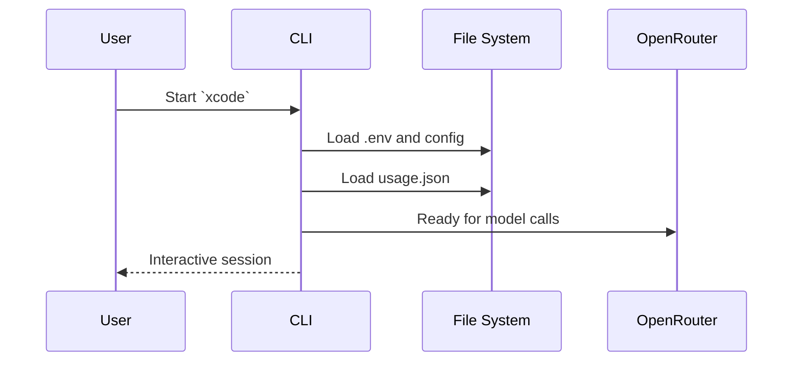
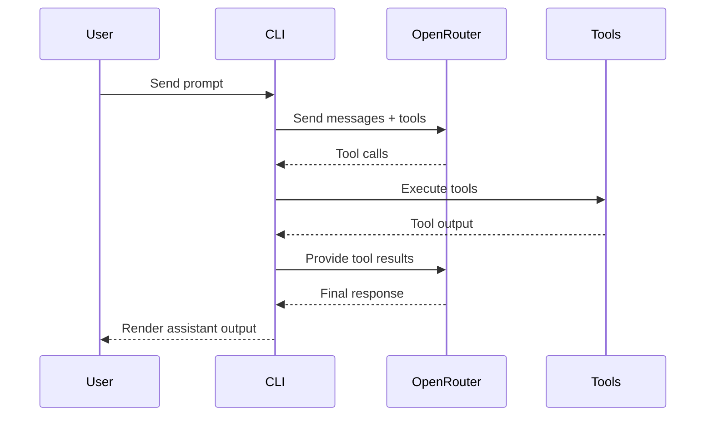
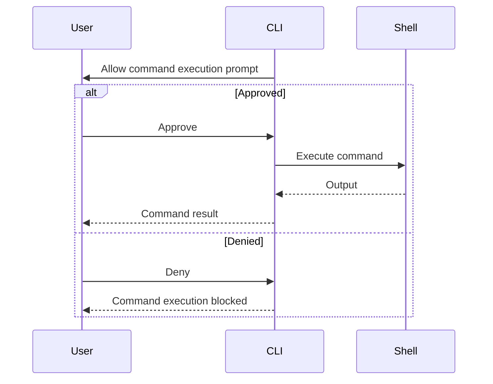

# Xcode CLI

Xcode is a terminal-native, agentic programming CLI that orchestrates file I O, edits, directory listing, and command execution through OpenRouter-backed models. It ships as a standalone package inside this repo and is designed for global installation.

## Global Install

```bash
npm install -g @xtool.ai/xcode
```

## Capability Summary

| Capability | Description |
| --- | --- |
| Interactive agent | Multi-turn session with tool calling. |
| Workspace config | Per-project or global model configuration. |
| Tool execution | Read, write, edit, list, run commands with confirmation. |
| Usage tracking | Request and token totals persisted per user. |
| Model selection | Curated model list with interactive picker. |

## Commands

| Command | Purpose |
| --- | --- |
| `xcode` | Start interactive session. |
| `xcode help` | Display CLI help. |
| `xcode init` | Create workspace config in `.xcode/config.json`. |
| `xcode model` | Show the current model. |
| `xcode model list` | List supported models. |
| `xcode model set NAME` | Set model (use `--global` for user scope). |
| `xcode plan TASK` | Generate a concise plan for a task. |
| `xcode usage` | Show usage totals for this session and lifetime. |

## Slash Commands (Interactive)

| Slash Command | Purpose |
| --- | --- |
| `/help` | Help text. |
| `/model` | Model picker. |
| `/plan <task>` | Generate a short plan. |
| `/usage` | Show usage totals. |
| `/exit` | Exit session. |

## Models

| Rank | Label | Model ID |
| --- | --- | --- |
| 1 | Xcode 3 Pro | `openai/gpt-4.1-mini` |
| 2 | Xcode 2.5 Flash | `openai/gpt-4o-mini` |
| 3 | Xcode 2.5 Core | `qwen/qwen-2.5-7b-instruct` |
| 4 | Xcode 2 Lite | `mistralai/mistral-small-latest` |

Default model: `openai/gpt-4.1-mini`

## Tooling Surface

| Tool | Purpose | Notes |
| --- | --- | --- |
| `read_file` | Read file contents. | Optional byte limit. |
| `write_file` | Write content to disk. | Respects overwrite flag. |
| `edit_file` | Find and replace text. | Single or global replacement. |
| `list_dir` | List directory contents. | Configurable depth. |
| `run_command` | Execute shell commands. | Prompts if execution is not allowed. |

## Configuration

| Scope | Path | Resolution Order |
| --- | --- | --- |
| Workspace | `.xcode/config.json` | First priority. |
| Global | `~/.xcode/config.json` | Second priority. |
| Default | In-memory defaults | Used when no config exists. |

Configuration fields:

| Field | Type | Purpose |
| --- | --- | --- |
| `model` | string | OpenRouter model identifier. |
| `allowExec` | boolean | Enable or require approval for `run_command`. |

## Environment Variables

| Variable | Purpose |
| --- | --- |
| `OPENROUTER_API_KEY` | Required for model access. |
| `XCODE_CELL_ASPECT` | Optional aspect ratio tuning for banner rendering. |
| `XCODE_IMAGE_PROTOCOL` | Optional protocol override for inline images. |

The CLI loads environment variables from:

- Project `.env` (current working directory)
- Global `~/.xcode/.env`

## Execution Flows

### Startup and Session Initialization

| Step | Outcome |
| --- | --- |
| Load API key | Reads environment and `.env` files. |
| Load config | Resolves workspace then global config. |
| Load usage | Reads `~/.xcode/usage.json`. |
| Launch UI | Starts Ink session and input loop. |



### Agent Loop and Tool Calling

| Step | Outcome |
| --- | --- |
| Compose messages | System prompt plus user history. |
| Call model | OpenRouter chat completions. |
| Execute tools | Run tool calls and capture output. |
| Iterate | Up to 6 iterations before fallback. |



### Command Execution Confirmation

| Step | Outcome |
| --- | --- |
| Tool request | Model requests `run_command`. |
| Confirmation | User approves or denies command. |
| Execution | Command runs if approved. |



## Development

```bash
cd Xcode
npm install
node bin/xcode.js
```

## Notes

- The CLI targets OpenRouter chat completions (`/api/v1/chat/completions`).
- Usage totals persist at `~/.xcode/usage.json` across sessions.
- Command execution can be restricted by setting `allowExec` to `false`.
